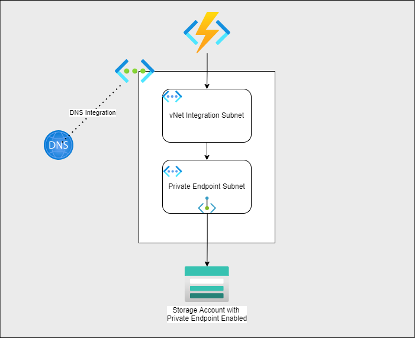

# Azure-Function-Apps-with-Private-Endpoints

Deployment will uses the built json file stored inside the main folder. Also I have the required BICEP template modules and main bicep files in this repo

## Summary

[]

This sample shows how to use Azure Functions with [private endpoints](https://docs.microsoft.com/azure/private-link/private-endpoint-overview) for Azure Storage.  The use of private endpoints enables private (virtual network only) access to designated Azure resources.

One of the key scenarios in this sample is the use of Azure Storage private endpoints with the storage account required for use with Azure Functions.  Azure Functions uses a storage account for metadata related to the runtime and various triggers, as well as application code.

### Azure Function

The Azure Function app provisioned in this template uses an [Azure Functions Premium plan](https://docs.microsoft.com/azure/azure-functions/functions-premium-plan#features).  The Premium plan is used to enable virtual network integration.  Virtual network integration is a must when its comes to communicating with the storage account

There are a few important details about the configuration of the function:

- Virtual network trigger support must be enabled in order for the function to trigger based on resources using a private endpoint
- In order to make [calls to a resource using a private endpoint](https://docs.microsoft.com/azure/azure-functions/functions-networking-options#azure-dns-private-zones), it is necessary to integrate with Azure DNS Private Zones. Therefore, it is necessary to configure the app to use a specific Azure DNS server.  This is accomplished by setting `WEBSITE_DNS_SERVER` to 168.63.129.16 and `WEBSITE_VNET_ROUTE_ALL` to 1.
- Enable the application content to be accessible over the virtual network.  This is accomplished by setting `WEBSITE_CONTENTOVERVNET` to 1.

For more information on restricting an Azure storage account to a virtual network for use with Azure Functions, please [refer to this official documentation](https://docs.microsoft.com/azure/azure-functions/configure-networking-how-to#restrict-your-storage-account-to-a-virtual-network).

### Azure Storage accounts

There are three Azure Storage accounts used in this sample:

- a storage accounts which use a private endpoint for the Azure Functions runtime
- a storage account with a private endpoint, which is set up with a blob container (created by the ARM template).  This is the storage account on which the function triggers (blob trigger).
- one storage account used by the VM for diagnostics

